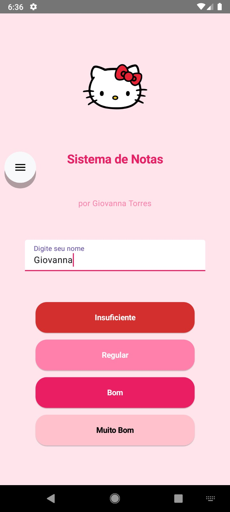
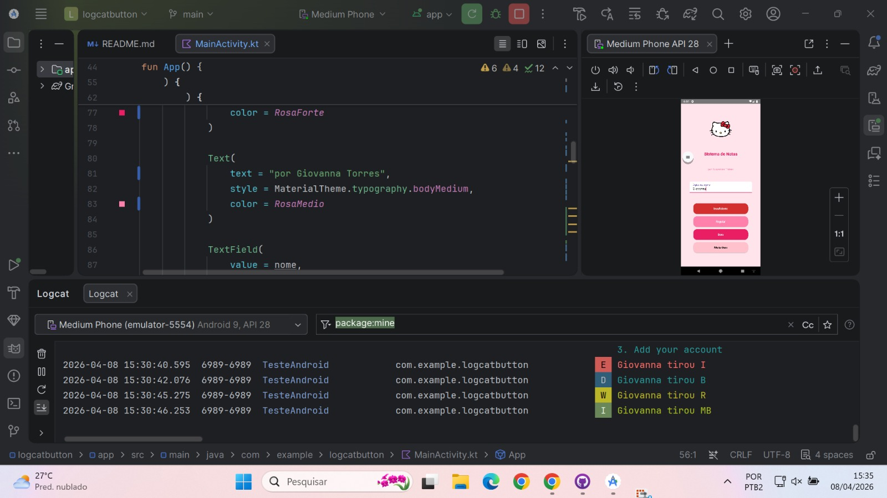
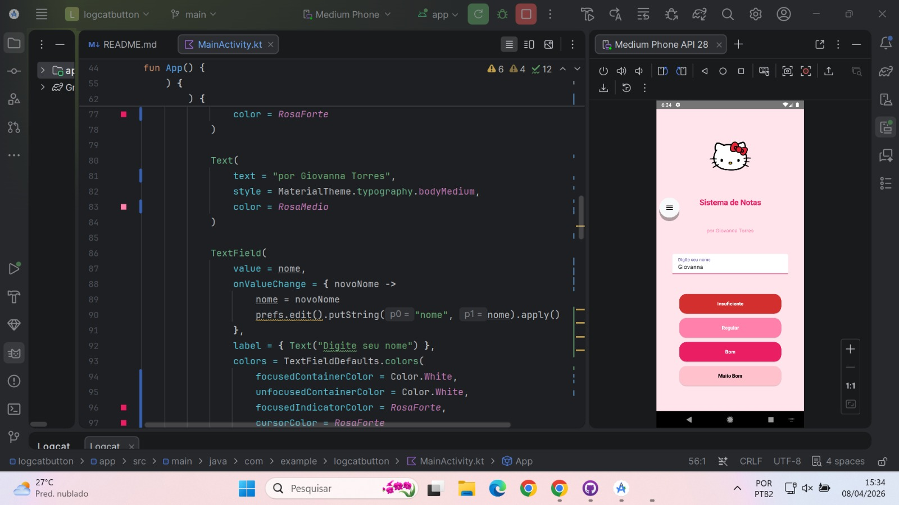

# 📱 Logcat App

Aplicativo Android desenvolvido em **Kotlin + Jetpack Compose** para demonstrar, na prática, os níveis de log do Android (`Log.e`, `Log.w`, `Log.d`, `Log.i`) utilizando a API `android.util.Log`.

 ## Funcionalidades

- Campo de texto para digitar o nome do usuário  
- Quatro botões representando diferentes níveis de log  
- Registro de logs em tempo real no Logcat  
- Simulação de uso real com mensagens personalizadas  

---

 ## Como funciona

Cada botão dispara um tipo específico de log no sistema:

| Botão | Método | Nível do Log | Descrição |
|------|--------|--------------|-----------|
| 🔴 **Menção I** | `Log.e()` | Erro | Indica que a menção é I |
| 🟠 **Menção R** | `Log.w()` | Aviso | Indica que a menção é R |
| 🟢 **Menção B** | `Log.d()` | Debug | Indica que a menção é B |
| 🔵 **Menção MB** | `Log.i()` | Informação | Indica que a menção é MB |

 O nome digitado é incluído na mensagem exibida no Logcat, simulando um cenário real de uso.

---

##  Screenshots

###  Tela do App

###  Saída no Logcat

### Projeto no Android Studio

---

##  Tecnologias utilizadas

- Kotlin  
- Jetpack Compose  
- Android SDK  
- Logcat (`android.util.Log`)  

---

##  Possíveis melhorias

- Filtro de logs por TAG  
- Visualização dos logs dentro do app  
- Exportação de logs  
- Interface mais interativa  

---

##  Autora

Projeto desenvolvido por **Giovanna Alves Martins Torres**

---

##  Licença

Este projeto está sob a licença MIT - sinta-se livre para usar e modificar.
